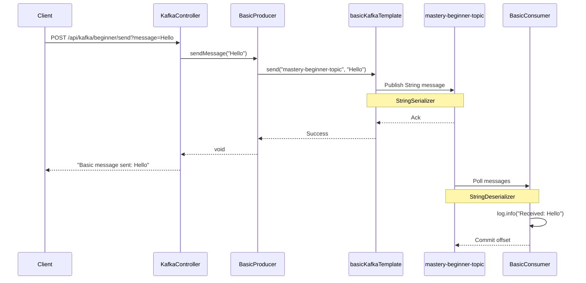
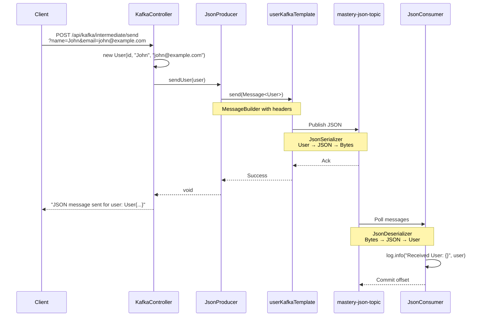
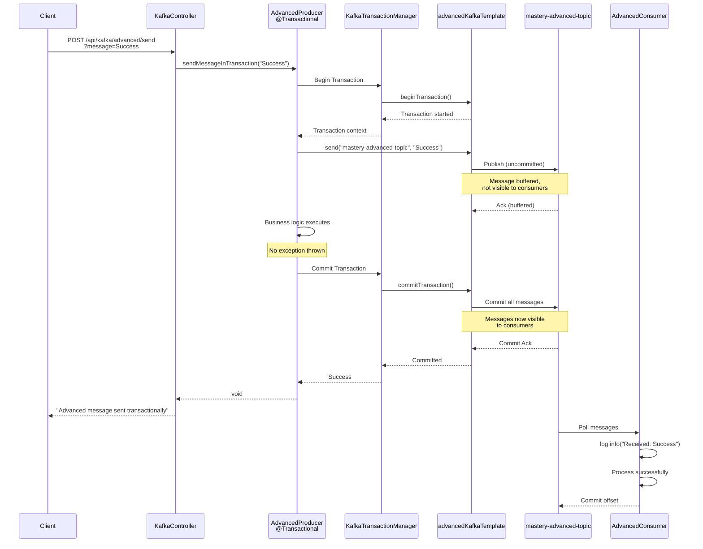
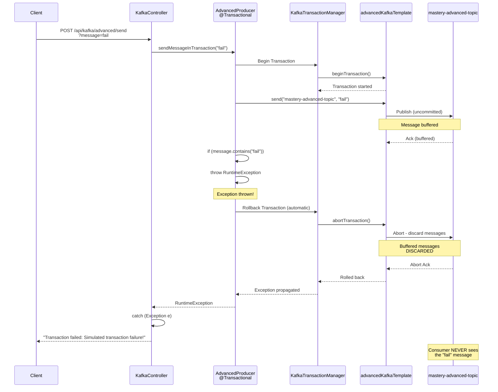
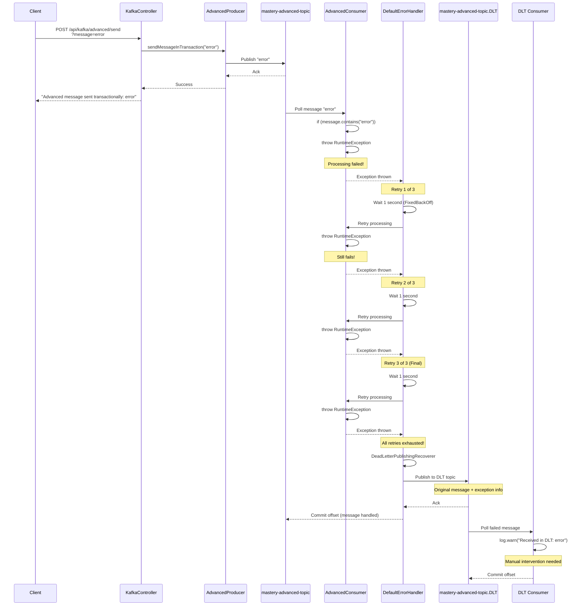
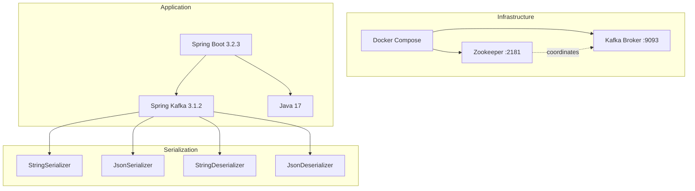

# Kafka Mastery - Architecture Flow Diagrams

**Author:** Shivam Srivastav

---

## Overall System Architecture

```mermaid
graph TB
    subgraph "Client Layer"
        Client[REST Client/curl]
    end
    
    subgraph "Spring Boot Application :8080"
        Controller[KafkaController<br/>REST Endpoints]
        
        subgraph "Beginner Level"
            BP[BasicProducer]
            BC[BasicConsumer]
        end
        
        subgraph "Intermediate Level"
            JP[JsonProducer]
            JC[JsonConsumer]
        end
        
        subgraph "Advanced Level"
            AP[AdvancedProducer<br/>@Transactional]
            AC[AdvancedConsumer<br/>Retry + DLQ]
            DLT[DLT Consumer]
        end
        
        subgraph "Configuration Layer"
            Config[KafkaConfig<br/>Bean Definitions]
            BTmpl[basicKafkaTemplate]
            UTmpl[userKafkaTemplate]
            ATmpl[advancedKafkaTemplate]
            TxMgr[KafkaTransactionManager]
        end
    end
    
    subgraph "Kafka Cluster :9093"
        subgraph "Topics"
            T1[mastery-beginner-topic<br/>3 partitions]
            T2[mastery-json-topic<br/>3 partitions]
            T3[mastery-advanced-topic<br/>3 partitions]
            T4[mastery-advanced-topic.DLT<br/>Dead Letter Topic]
        end
    end
    
    Client -->|HTTP POST| Controller
    Controller --> BP
    Controller --> JP
    Controller --> AP
    
    Config -.->|provides| BTmpl
    Config -.->|provides| UTmpl
    Config -.->|provides| ATmpl
    Config -.->|provides| TxMgr
    
    BP -->|uses| BTmpl
    JP -->|uses| UTmpl
    AP -->|uses| ATmpl
    AP -->|uses| TxMgr
    
    BTmpl -->|String| T1
    UTmpl -->|JSON| T2
    ATmpl -->|Transactional| T3
    
    T1 -->|consume| BC
    T2 -->|consume| JC
    T3 -->|consume| AC
    AC -->|on failure| T4
    T4 -->|consume| DLT
    
    style Client fill:#e1f5ff
    style Controller fill:#fff4e1
    style Config fill:#f0f0f0
    style T1 fill:#c8e6c9
    style T2 fill:#c8e6c9
    style T3 fill:#c8e6c9
    style T4 fill:#ffcdd2
```

---

## Flow 1: Beginner Level - Basic String Messaging



**Key Components:**
- **Serialization:** String → Bytes
- **Deserialization:** Bytes → String
- **Consumer Group:** `beginner-group`
- **Partitions:** 3 (for parallel processing)

---

## Flow 2: Intermediate Level - JSON Serialization



**Key Components:**
- **Serialization:** User Object → JSON → Bytes
- **Deserialization:** Bytes → JSON → User Object
- **Consumer Group:** `json-group`
- **Custom Factory:** `userKafkaListenerContainerFactory`

---

## Flow 3: Advanced Level - Transactional Success



**Key Components:**
- **Idempotency:** `enable.idempotence=true`
- **Transaction ID:** `transactional.id=tx-`
- **Isolation:** Messages invisible until commit
- **Atomicity:** All or nothing

---

## Flow 4: Advanced Level - Transaction Rollback



**Key Points:**
- ❌ Exception thrown → Transaction rolled back
- ❌ Message never committed to Kafka
- ❌ Consumer never receives the message
- ✅ Atomicity guaranteed

---

## Flow 5: Advanced Level - Dead Letter Queue (DLQ)



**Key Components:**
- **Error Handler:** `DefaultErrorHandler`
- **Retry Strategy:** `FixedBackOff(1000L, 3)` - 3 retries, 1s apart
- **Recoverer:** `DeadLetterPublishingRecoverer`
- **DLT Topic:** Auto-created as `{original-topic}.DLT`

---

## Component Dependency Graph

```mermaid
graph LR
    subgraph "Spring Beans"
        Config[KafkaConfig]
        
        BPF[basicProducerFactory]
        BKT[basicKafkaTemplate]
        
        UPF[userProducerFactory]
        UKT[userKafkaTemplate]
        UCF[userConsumerFactory]
        UCLF[userKafkaListenerContainerFactory]
        
        APF[advancedProducerFactory]
        AKT[advancedKafkaTemplate]
        TxMgr[kafkaTransactionManager]
        ACLF[advancedListenerContainerFactory]
    end
    
    subgraph "Producers"
        BP[BasicProducer]
        JP[JsonProducer]
        AP[AdvancedProducer]
    end
    
    subgraph "Consumers"
        BC[BasicConsumer]
        JC[JsonConsumer]
        AC[AdvancedConsumer]
        DLT[DLT Consumer]
    end
    
    Config -->|creates| BPF
    Config -->|creates| UPF
    Config -->|creates| APF
    
    BPF -->|used by| BKT
    UPF -->|used by| UKT
    APF -->|used by| AKT
    APF -->|used by| TxMgr
    
    UCF -->|used by| UCLF
    
    BP -->|@Autowired| BKT
    JP -->|@Autowired| UKT
    AP -->|@Autowired| AKT
    AP -->|@Autowired| TxMgr
    
    BC -.->|default factory| Config
    JC -->|containerFactory| UCLF
    AC -->|containerFactory| ACLF
    DLT -.->|default factory| Config
    
    style Config fill:#f0f0f0
    style TxMgr fill:#ffe0b2
    style ACLF fill:#ffe0b2
```

---

## Data Flow Summary

### Beginner Flow
```
Client → Controller → BasicProducer → basicKafkaTemplate 
→ mastery-beginner-topic → BasicConsumer
```

### Intermediate Flow
```
Client → Controller → JsonProducer → userKafkaTemplate 
→ mastery-json-topic → JsonConsumer
```

### Advanced Flow (Success)
```
Client → Controller → AdvancedProducer → @Transactional 
→ advancedKafkaTemplate → mastery-advanced-topic 
→ AdvancedConsumer
```

### Advanced Flow (Rollback)
```
Client → Controller → AdvancedProducer → @Transactional 
→ Exception → Rollback → Consumer never sees message
```

### Advanced Flow (DLQ)
```
Client → Controller → AdvancedProducer → mastery-advanced-topic 
→ AdvancedConsumer → Fails → Retry 3x → DLT 
→ DLT Consumer
```

---

## Technology Stack



---

## All Concepts Covered

| Level | Concept | Implementation |
|-------|---------|----------------|
| **Beginner** | Basic Producer | `BasicProducer.java` |
| | Basic Consumer | `BasicConsumer.java` |
| | String Serialization | `StringSerializer` |
| | Topic Configuration | `@Bean NewTopic` |
| **Intermediate** | JSON Serialization | `JsonSerializer` |
| | JSON Deserialization | `JsonDeserializer` |
| | Custom Factories | `userProducerFactory()` |
| | Consumer Groups | `groupId="json-group"` |
| **Advanced** | Idempotent Producer | `enable.idempotence=true` |
| | Transactions | `@Transactional` |
| | Transaction Manager | `KafkaTransactionManager` |
| | Error Handling | `DefaultErrorHandler` |
| | Retry Mechanism | `FixedBackOff(1000L, 3)` |
| | Dead Letter Queue | `DeadLetterPublishingRecoverer` |
| | Bean Qualification | `@Qualifier` |

