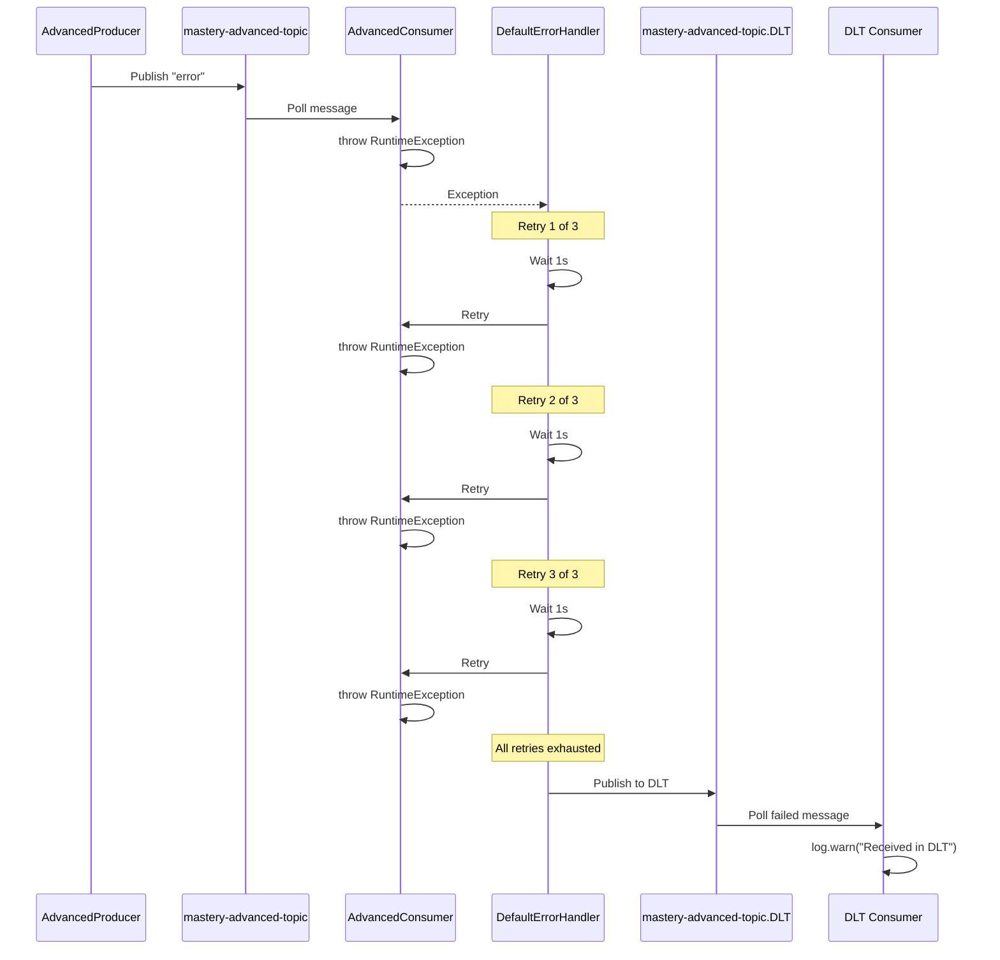

# Kafka Mastery - From Beginner to Advanced

[](https://www.oracle.com/java/)
[](https://spring.io/projects/spring-boot)
[](https://kafka.apache.org/)
[](LICENSE)

**Author:** Shivam Srivastav

A comprehensive Spring Boot application demonstrating Apache Kafka concepts from beginner to advanced levels. This project serves as a complete learning resource with extensive documentation, comments, and real-world examples.

---

## 🎯 Project Overview

This project demonstrates **all major Kafka concepts** through three progressive levels:

| Level | Concepts | Topics |
|-------|----------|--------|
| **Beginner** | Basic Producer/Consumer, String Serialization | `mastery-beginner-topic` |
| **Intermediate** | JSON Serialization, Custom Factories | `mastery-json-topic` |
| **Advanced** | Transactions, Idempotency, Error Handling, DLQ | `mastery-advanced-topic`, `mastery-advanced-topic.DLT` |

---

## 📋 Table of Contents

- [Features](#-features)
- [Architecture](#-architecture)
- [Prerequisites](#-prerequisites)
- [Quick Start](#-quick-start)
- [API Endpoints](#-api-endpoints)
- [Concepts Covered](#-concepts-covered)
- [Project Structure](#-project-structure)
- [Configuration](#-configuration)
- [Testing](#-testing)
- [Documentation](#-documentation)

---

## ✨ Features

### Beginner Level
- ✅ Basic String Producer/Consumer
- ✅ Topic configuration with partitions
- ✅ Simple pub/sub pattern
- ✅ Consumer groups

### Intermediate Level
- ✅ JSON serialization/deserialization
- ✅ Custom `ProducerFactory` and `ConsumerFactory`
- ✅ Multiple `KafkaTemplate` configurations
- ✅ Complex object messaging

### Advanced Level
- ✅ **Transactional messaging** with `@Transactional`
- ✅ **Idempotent producers** (exactly-once semantics)
- ✅ **Error handling** with retry mechanism
- ✅ **Dead Letter Queue (DLQ)** for failed messages
- ✅ **Transaction rollback** on exceptions
- ✅ `KafkaTransactionManager` integration

---

## 🏗️ Architecture

### Overall System Architecture

```mermaid
graph TB
    subgraph "Client Layer"
        Client[REST Client/curl]
    end
    
    subgraph "Spring Boot Application :8080"
        Controller[KafkaController<br/>REST Endpoints]
        
        subgraph "Beginner Level"
            BP[BasicProducer]
            BC[BasicConsumer]
        end
        
        subgraph "Intermediate Level"
            JP[JsonProducer]
            JC[JsonConsumer]
        end
        
        subgraph "Advanced Level"
            AP[AdvancedProducer<br/>@Transactional]
            AC[AdvancedConsumer<br/>Retry + DLQ]
            DLT[DLT Consumer]
        end
        
        subgraph "Configuration Layer"
            Config[KafkaConfig<br/>Bean Definitions]
            BTmpl[basicKafkaTemplate]
            UTmpl[userKafkaTemplate]
            ATmpl[advancedKafkaTemplate]
            TxMgr[KafkaTransactionManager]
        end
    end
    
    subgraph "Kafka Cluster :9093"
        subgraph "Topics"
            T1[mastery-beginner-topic<br/>3 partitions]
            T2[mastery-json-topic<br/>3 partitions]
            T3[mastery-advanced-topic<br/>3 partitions]
            T4[mastery-advanced-topic.DLT<br/>Dead Letter Topic]
        end
    end
    
    Client -->|HTTP POST| Controller
    Controller --> BP
    Controller --> JP
    Controller --> AP
    
    Config -.->|provides| BTmpl
    Config -.->|provides| UTmpl
    Config -.->|provides| ATmpl
    Config -.->|provides| TxMgr
    
    BP -->|uses| BTmpl
    JP -->|uses| UTmpl
    AP -->|uses| ATmpl
    AP -->|uses| TxMgr
    
    BTmpl -->|String| T1
    UTmpl -->|JSON| T2
    ATmpl -->|Transactional| T3
    
    T1 -->|consume| BC
    T2 -->|consume| JC
    T3 -->|consume| AC
    AC -->|on failure| T4
    T4 -->|consume| DLT
    
    style Client fill:#e1f5ff
    style Controller fill:#fff4e1
    style Config fill:#f0f0f0
    style T1 fill:#c8e6c9
    style T2 fill:#c8e6c9
    style T3 fill:#c8e6c9
    style T4 fill:#ffcdd2
```

### Dead Letter Queue Flow



---

## 🔧 Prerequisites

- **Java 17** or higher
- **Maven 3.6+**
- **Docker & Docker Compose**
- **curl** (for testing)

---

## 🚀 Quick Start

### 1. Clone the Repository
```bash
git clone https://github.com/shivamsrivastav/kafka-mastery-demo.git
cd kafka-mastery-demo
```

### 2. Start Kafka Infrastructure
```bash
docker-compose up -d
```

This starts:
- Zookeeper on port `2181`
- Kafka broker on port `9093`

### 3. Run the Application
```bash
mvn spring-boot:run
```

The application starts on `http://localhost:8080`

### 4. Test the Endpoints

**Beginner Flow:**
```bash
curl -X POST "http://localhost:8080/api/kafka/beginner/send?message=HelloWorld"
```

**Intermediate Flow:**
```bash
curl -X POST "http://localhost:8080/api/kafka/intermediate/send?name=John&email=john@example.com"
```

**Advanced Flow (Success):**
```bash
curl -X POST "http://localhost:8080/api/kafka/advanced/send?message=Success"
```

**Advanced Flow (Transaction Rollback):**
```bash
curl -X POST "http://localhost:8080/api/kafka/advanced/send?message=fail"
```

**Advanced Flow (DLQ):**
```bash
curl -X POST "http://localhost:8080/api/kafka/advanced/send?message=error"
```

---

## 🌐 API Endpoints

| Endpoint | Method | Description | Example |
|----------|--------|-------------|---------|
| `/api/kafka/beginner/send` | POST | Send basic string message | `?message=Hello` |
| `/api/kafka/intermediate/send` | POST | Send JSON User object | `?name=John&email=john@example.com` |
| `/api/kafka/advanced/send` | POST | Send transactional message | `?message=Success` |

### Response Examples

**Beginner:**
```json
"Basic message sent: HelloWorld"
```

**Intermediate:**
```json
"JSON message sent for user: User{id=1234567890, name='John', email='john@example.com'}"
```

**Advanced (Success):**
```json
"Advanced message sent transactionally: Success"
```

**Advanced (Rollback):**
```json
"Transaction failed: Simulated transaction failure!"
```

---

## 📚 Concepts Covered

### Beginner Level
- **Basic Producer/Consumer Pattern**
  - `BasicProducer.java` - Sends string messages
  - `BasicConsumer.java` - Receives string messages
- **String Serialization**
  - `StringSerializer` / `StringDeserializer`
- **Topic Configuration**
  - Programmatic topic creation with `TopicBuilder`
  - Partition configuration (3 partitions)
- **Consumer Groups**
  - `beginner-group` for message distribution

### Intermediate Level
- **JSON Serialization/Deserialization**
  - `JsonSerializer` for User objects
  - `JsonDeserializer` with trusted packages
- **Custom Factories**
  - `userProducerFactory()` - JSON producer configuration
  - `userConsumerFactory()` - JSON consumer configuration
- **Multiple KafkaTemplates**
  - Separate templates for different data types
  - Bean qualification with `@Qualifier`

### Advanced Level
- **Idempotent Producers**
  - `enable.idempotence=true`
  - Prevents duplicate messages
- **Transactional Messaging**
  - `@Transactional` annotation
  - `KafkaTransactionManager` bean
  - `transactional.id` configuration
- **Transaction Rollback**
  - Automatic rollback on exceptions
  - Messages never committed on failure
- **Error Handling**
  - `DefaultErrorHandler` with retry logic
  - `FixedBackOff` strategy (3 retries, 1s interval)
- **Dead Letter Queue (DLQ)**
  - `DeadLetterPublishingRecoverer`
  - Failed messages sent to `.DLT` topic
  - Separate DLT consumer for manual intervention

---

## 📁 Project Structure

```
kafka-mastery-demo/
├── src/main/java/com/shivam/kafka/
│   ├── KafkaMasteryApplication.java       # Main application
│   ├── config/
│   │   └── KafkaConfig.java               # All Kafka bean configurations
│   ├── controller/
│   │   └── KafkaController.java           # REST endpoints
│   ├── beginner/
│   │   ├── BasicProducer.java             # String producer
│   │   └── BasicConsumer.java             # String consumer
│   ├── intermediate/
│   │   ├── JsonProducer.java              # JSON producer
│   │   └── JsonConsumer.java              # JSON consumer
│   ├── advanced/
│   │   ├── AdvancedProducer.java          # Transactional producer
│   │   └── AdvancedConsumer.java          # Consumer with DLQ
│   └── model/
│       └── User.java                      # POJO for JSON
├── src/main/resources/
│   └── application.properties             # Application configuration
├── docker-compose.yml                     # Kafka infrastructure
├── pom.xml                                # Maven dependencies
├── README.md                              # This file
├── ARCHITECTURE_FLOW.md                   # Detailed flow diagrams
├── WHY_BEAN_CONFIGURATION.md              # Bean configuration explanation
└── API_VERIFICATION_RESULTS.md            # Test results
```

---

## ⚙️ Configuration

### Application Properties
```properties
spring.application.name=kafka-mastery-demo
spring.kafka.bootstrap-servers=127.0.0.1:9093

# Consumer Configuration
spring.kafka.consumer.group-id=mastery-group
spring.kafka.consumer.auto-offset-reset=earliest
```

### Docker Compose
```yaml
services:
  zookeeper:
    image: confluentinc/cp-zookeeper:7.5.0
    ports:
      - "2181:2181"

  kafka:
    image: confluentinc/cp-kafka:7.5.0
    ports:
      - "9093:9092"
    environment:
      KAFKA_ADVERTISED_LISTENERS: PLAINTEXT://127.0.0.1:9093
      KAFKA_TRANSACTION_STATE_LOG_REPLICATION_FACTOR: 1
```

### Key Bean Configurations

**Basic Producer:**
```java
@Bean
public KafkaTemplate<String, String> basicKafkaTemplate() {
    return new KafkaTemplate<>(basicProducerFactory());
}
```

**JSON Producer:**
```java
@Bean
public KafkaTemplate<String, User> userKafkaTemplate() {
    return new KafkaTemplate<>(userProducerFactory());
}
```

**Transaction Manager:**
```java
@Bean
public KafkaTransactionManager<String, String> kafkaTransactionManager() {
    return new KafkaTransactionManager<>(advancedProducerFactory());
}
```

---

## 🧪 Testing

### Manual Testing
Use the provided curl commands in [Quick Start](#-quick-start)

### Expected Behavior

**Beginner Flow:**
- ✅ Producer sends message
- ✅ Consumer receives and logs message

**Intermediate Flow:**
- ✅ Producer serializes User to JSON
- ✅ Consumer deserializes JSON to User object

**Advanced Flow (Success):**
- ✅ Transaction begins
- ✅ Message sent
- ✅ Transaction commits
- ✅ Consumer receives message

**Advanced Flow (Rollback):**
- ✅ Transaction begins
- ✅ Message sent (buffered)
- ❌ Exception thrown
- ✅ Transaction rolls back
- ❌ Consumer NEVER receives message

**Advanced Flow (DLQ):**
- ✅ Consumer receives message
- ❌ Processing fails
- ⏱️ Retry 1 (wait 1s) → fails
- ⏱️ Retry 2 (wait 1s) → fails
- ⏱️ Retry 3 (wait 1s) → fails
- ✅ Message sent to DLT
- ✅ DLT consumer logs failed message

---

## 📖 Documentation

Additional documentation available:

- **[ARCHITECTURE_FLOW.md](ARCHITECTURE_FLOW.md)** - Detailed Mermaid diagrams for all flows
- **[WHY_BEAN_CONFIGURATION.md](WHY_BEAN_CONFIGURATION.md)** - Explanation of Spring beans vs native Kafka
- **[API_VERIFICATION_RESULTS.md](API_VERIFICATION_RESULTS.md)** - Complete test results

---

## 🎓 Learning Path

1. **Start with Beginner** - Understand basic pub/sub
2. **Move to Intermediate** - Learn custom serialization
3. **Master Advanced** - Implement transactions and error handling

Each level builds upon the previous, with extensive comments explaining:
- **What** the code does
- **Why** it's implemented this way
- **When** to use each pattern

---

## 🛠️ Technologies Used

- **Spring Boot 3.2.3** - Application framework
- **Spring Kafka 3.1.2** - Kafka integration
- **Apache Kafka 7.5.0** - Message broker
- **Java 17** - Programming language
- **Maven** - Build tool
- **Docker Compose** - Infrastructure orchestration

---

## 📝 Key Takeaways

1. **Bean Configuration** - Spring beans provide dependency injection, lifecycle management, and testability
2. **Transactions** - Use `@Transactional` for atomic operations
3. **Error Handling** - Implement retries and DLQ for resilient systems
4. **Serialization** - Choose appropriate serializers for your data types
5. **Idempotency** - Enable for exactly-once semantics

---

## 🤝 Contributing

Contributions are welcome! Please feel free to submit a Pull Request.

---

## 📄 License

This project is licensed under the MIT License.

---

## 👤 Author

**Shivam Srivastav**

- GitHub: [@shivamsrivastav](https://github.com/shivamsrivastav)

---

## 🙏 Acknowledgments

- Apache Kafka documentation
- Spring Kafka reference guide
- Spring Boot community

---

## 📞 Support

If you have questions or need help, please open an issue on GitHub.

---

**Happy Learning! 🚀**
